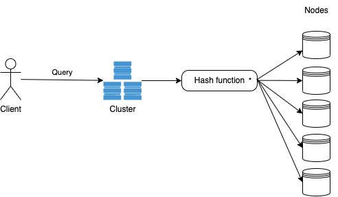

# OtterDB Architecture Overview - WIP
This document describes the high-level architecture of OtterDB.

## Scope and Purpose
OtterDB is a locally distributed key-value database. It's not replicated across nodes, as the main goal is not duplication. It's a hobby project aimed at learning the basic underlying workings of 
databases. Its aim is not to be a production-ready database.

## Bird's view
```mermaid
graph TD;
    Client->>+OtterDB: SET `key` `value`
    Client->>+OtterDB: GET `key`
    OtterDB->>-Client: `value`
```

On a high level OtterDB is a simple key-value store. The client can perform typical commands like `GET` and `SET` on the instance.  
Keys are `string` while the values can be anything, OtterDB will manage the value type internally.

A more detailed but still high-level flow would be:  


## Components
### Cluster
The `cluster` is the component managing multiple nodes. It has a public facing API which allows the clients to perform 
actions without worrying about the underlying nodes.

### Node
A node receives inputs from the cluster and perform the actual actions, like writing data to the disk.

## Code Map
### cmd
Executables for public-facing features, including the API and the REPL.

### internal
Includes code used internally, like the core data structures.

### pkg
Includes code that should be exposed to anyone importing the library.

## Performance
While performance is not a cor objective, everything is done also thinking about that.  
Benchmarks cover every part of the application and they're tracked to avoid regressions.